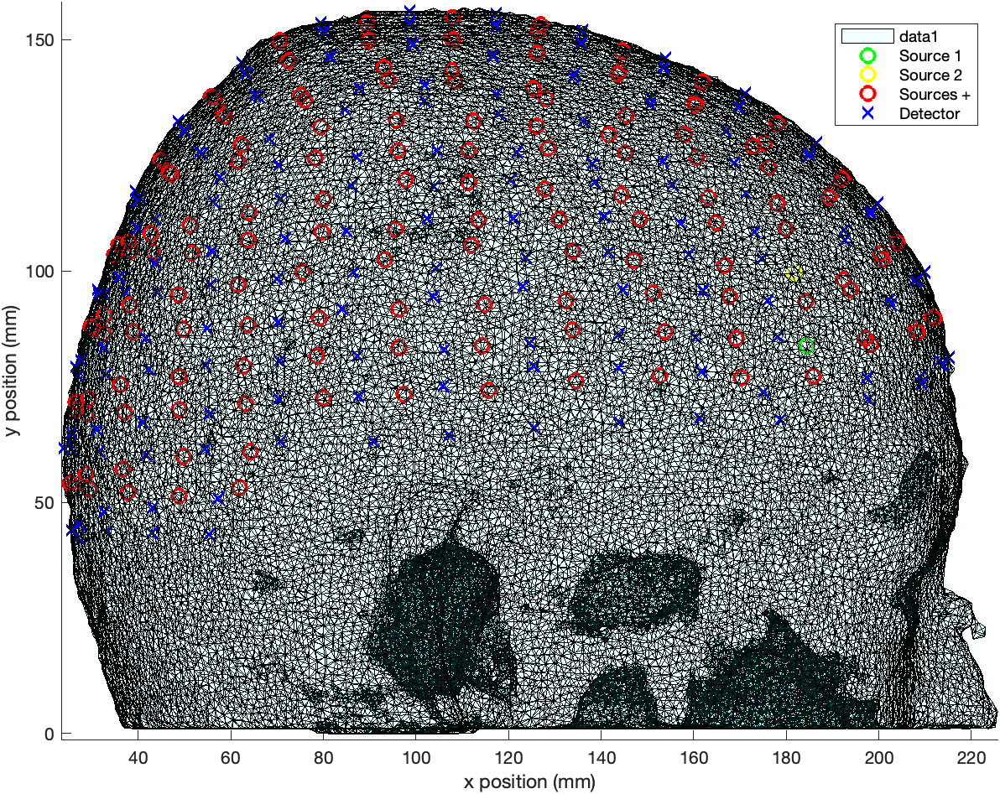
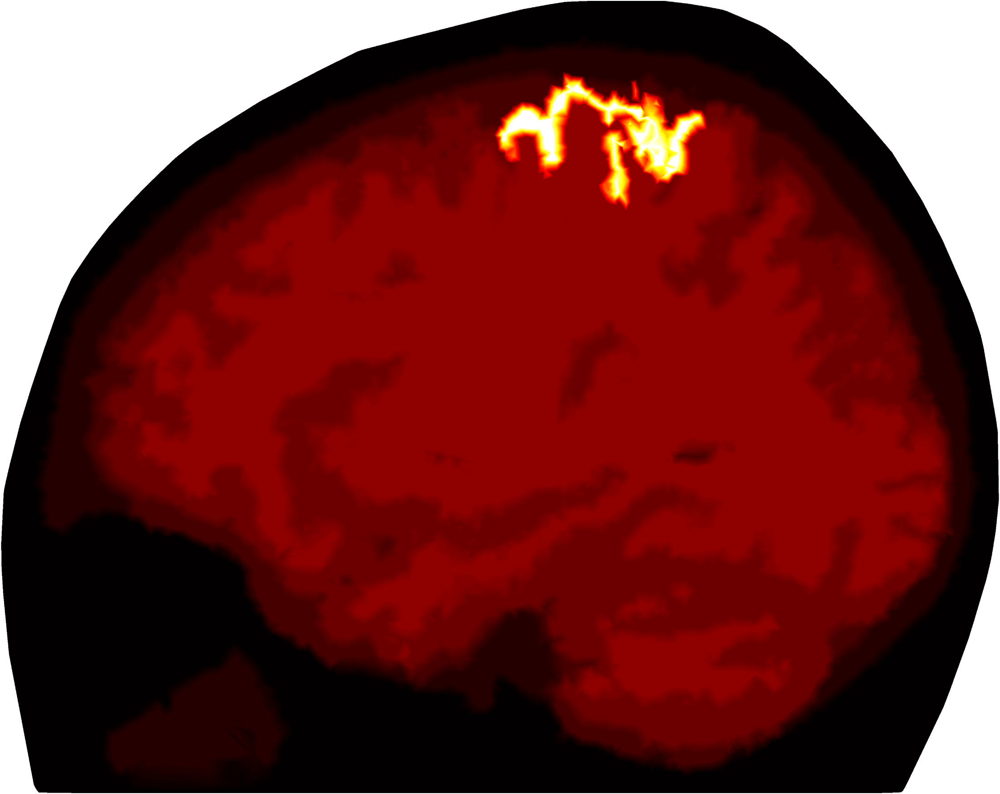
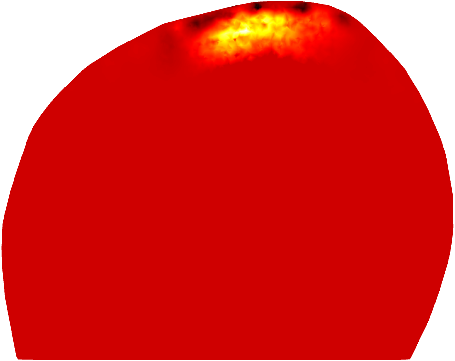
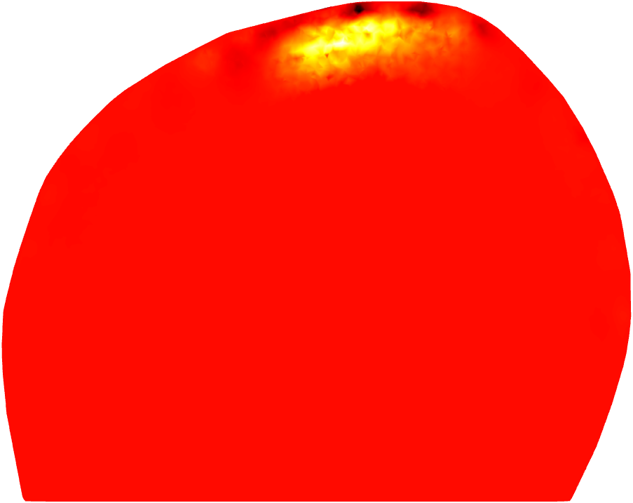
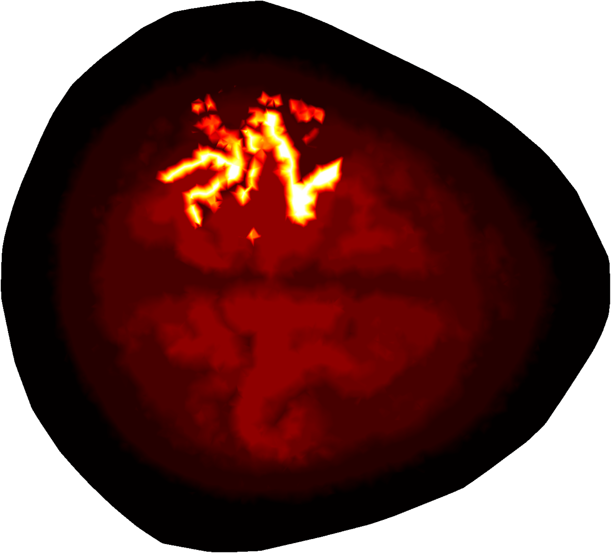
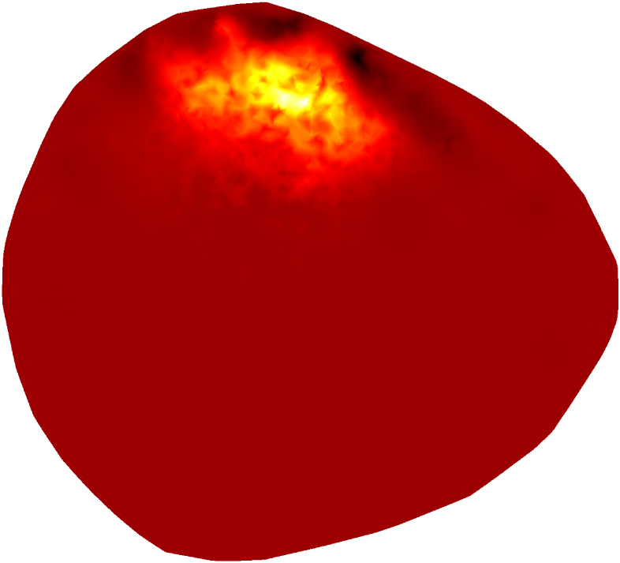
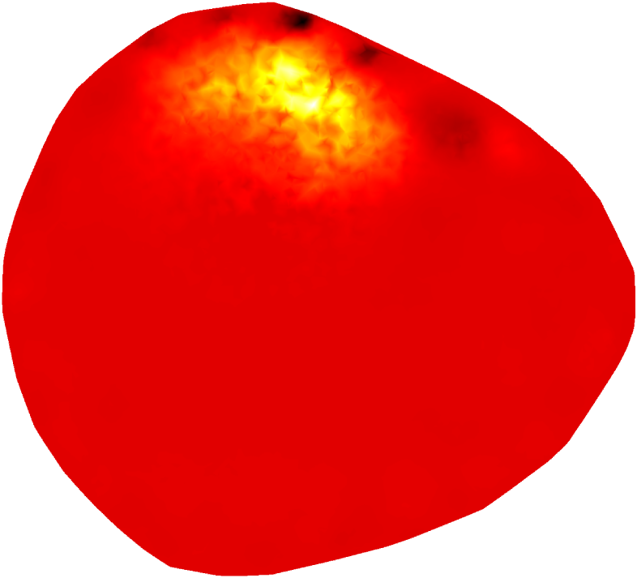

# Data Driven Dimensionality Reduction of Jacobian in Diffuse Optical Tomography



## Research Objective
The research objective is to develop techniques that reduce the spatial dimensionality of the Jacobian matrix. This reduction will result in substantial savings in computational resources required for Jacobian inversion in the inverse problem of fNIR-DOT image reconstruction.

---
## Methodology

| Total Sensitivity Threshold | Transformation Matrix(PCA) |
|---|---|
| 1% | 74\% cumulative variance \| 600PCs |

---
## Results

| Cross Section | Simulated | Conventional | Data Reduction |
|---|---|---|---|
| Sagittal Cross Section |  |  |  |
| Horizontal Cross Section |  |  |  |


---
## Requirements

1. Matlab

2. Download and install [NIRFASTER](https://github.com/nirfaster/NIRFASTer)

`git clone https://github.com/nirfaster/NIRFASTer`


## Usage

1. Set MATLAB path (with subfolders) to the NIRFASTer folder.

2. The subfolders have been arranged in the same order as methodology, each subfolder has a Live Script (.mlx) file which contains the main code for that particular method.


## File Structure
```bash
.
├── 1_conventional
│   └── reg.mlx
├── 2_PCA
│   └── PCA.mlx
├── 3_MDS
│   └── MDS.mlx
├── 4_isomap
│   ├── isomap.ipynb
│   ├── isomap.mlx
│   └── var
│       ├── J1.csv
│       └── Up.mat
├── 5_LLE
│   └── LLE.mlx
├── 6_autoencoders
│   └── autoencoders.mlx
├── 7_UMAP
│   ├── UMAP.ipynb
│   ├── UMAP.mlx
│   └── var
│       ├── J1.csv
│       └── U_p.mat
├── Images
│   └── 3D_mesh_xy_plane.png
├── LICENSE
├── README.md
├── functions
│   ├── H_matrix.m
│   ├── PCA.m
│   ├── distance_matrix.m
│   ├── plot3dmesh.m
│   └── plotHeatmap.m
└── variable
    ├── jacobian
    │   └── 2D.mat
    └── meshes
        └── subject10_stnd.mat

15 directories, 23 files
```
